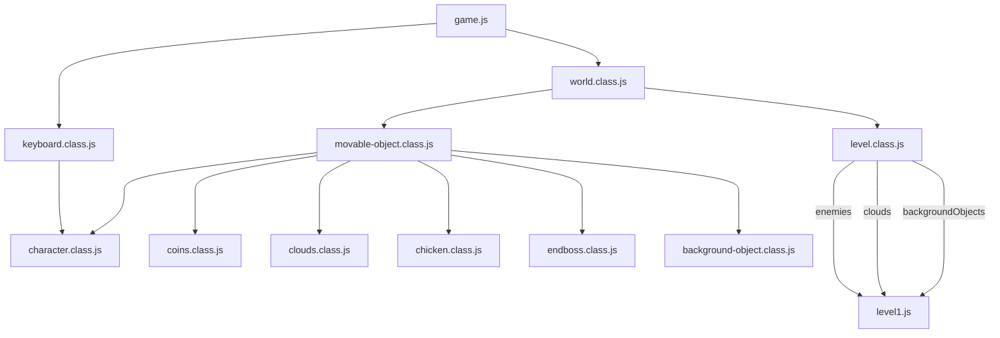

# Mermaid Demo

```mermaid
flowchart TD;
    GA[game.js] --> WO[world.class.js]
    GA[game.js] --> KE[keyboard.class.js]


    WO[world.class.js] --> LV[level.class.js]
    WO[world.class.js] --> MO[movable-object.class.js]

    KE[keyboard.class.js] ---> CA[character.class.js]

    LV[level.class.js] ----> |enemies| LV1[level1.js]
    LV[level.class.js] ----> |clouds| LV1[level1.js]
    LV[level.class.js] ----> |backgroundObjects| LV1[level1.js]

    MO[movable-object.class.js] ---> CO[coins.class.js]
    MO[movable-object.class.js] ---> CL[clouds.class.js]
    MO[movable-object.class.js] ---> CH[chicken.class.js]
    MO[movable-object.class.js] ---> EN[endboss.class.js]
    MO[movable-object.class.js] ---> BG[background-object.class.js]
    MO[movable-object.class.js] ---> CA[character.class.js]


```
